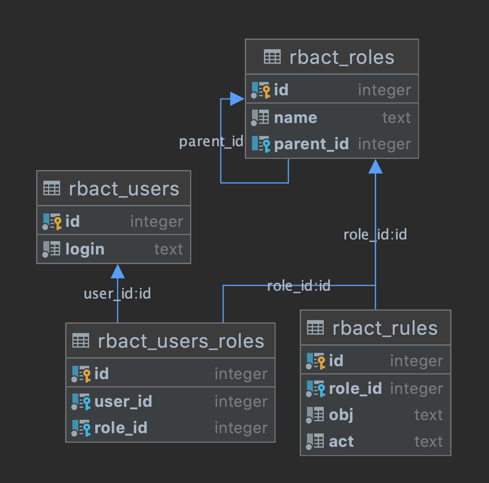

rbact
=======
A simple RBAC library with different ORM adapters
* has sync and async implementation
* supports peewee/peewee_async
* stores access data in normal form
* doesn't use cache (at least right now), so doesn't need to reload data and performs best with small role inheritance tree

## Content

- [Installation](#installation)
- [Docs](#docs)
  - [Peewee hello world](#peewee-hello-world)
  - [Peewee async example](#peewee-async-example-with-a-connection-pool-and-model-extensions)
  - [How it works?](#how-it-works)
  - [Superuser](#superuser)
  - [Get all user rules/roles](#get-all-user-rulesroles)

## Installation
```
# Basic
pip install rbact

# With adapter's dependencies
pip install rbact[peewee]
pip install rbact[peewee_async]
```

## Docs
### Peewee hello world 
```python
from peewee import PostgresqlDatabase
import rbact

db = PostgresqlDatabase('my_app', user='postgres', password='secret',
                           host='10.1.0.9', port=5432)

adapter = rbact.peewee.PeeweeAdapter(db)
adapter.create_tables()
inspector = rbact.Inspector(adapter)
result = inspector.has_access('user', 'resource', 'write')
```
With peewee your application needs to close connections explicitly. `adapter.create_tables()` and `inspector.has_access()` methods follow this logic and don't close connections by themselves.

### Peewee async example with a connection pool and model extensions
```python
import peewee as pw
from peewee_async import PooledPostgresqlDatabase, Manager
from rbact import peewee_async as rbact_peewee, AsyncInspector

db = PooledPostgresqlDatabase('my_app', user='postgres', password='secret',
                           host='10.1.0.9', port=5432)
db_manager = Manager(db)

# model extension
class Users(rbact_peewee.Users):
    class Meta:
        table_name = 'custom_users'
    email = pw.TextField()

async def main():
    loader = rbact_peewee.ModelsLoader(db_manager.database, users_model=Users)
    adapter = rbact_peewee.AsyncPeeweeAdapter(db_manager, models_loader=loader)
    inspector = AsyncInspector(adapter)
    result = await inspector.has_access('user', 'resource', 'write')
```

### How it works?
Rbact uses 4 tables to store data, default tables look like this:

All these tables can be created automatically with `adapter.create_tables()`. You can extend any table using inheritance but default columns mustn't be changed.

#### Rbact rules examples
The user who wants to access, the object (or resource) to which access is requested, the action that the user wants to do
```
analyst, company_metrics, read
employee, /api/write_task, write 
```

### Superuser
```python
import rbact

db = ...

adapter = rbact.peewee.PeeweeAdapter(db)
inspector = rbact.Inspector(adapter)
inspector.superuser = 'root'  # default value is admin
inspector.superuser = None  # disable superuser
```

### Get all user rules/roles
```python
import rbact

db = ...

adapter = rbact.peewee.PeeweeAdapter(db)
inspector = rbact.Inspector(adapter)
# list of tuples
list_rules = inspector.get_user_rules('user', orient='list')
# dict with resource key and list of actions value
dict_rules = inspector.get_user_rules('user', orient='dict')

# list of roles
roles = inspector.get_user_roles('user')
```

